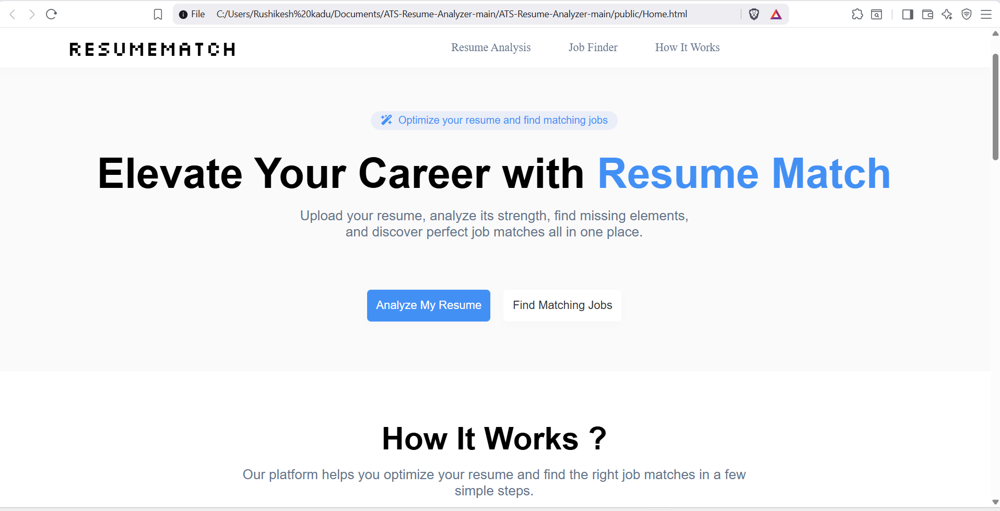

## Project Screenshot




# ATS Resume Analyzer (ResumeMatch)

**ATS Resume Analyzer** (a.k.a. *ResumeMatch*) is a compact web application that helps job-seekers optimize their resumes for applicant tracking systems (ATS) and discover matching job postings. Users upload a resume and paste a job description; the backend runs an ML-powered script (`ats.py`) that analyzes how well the resume matches the JD and returns a score + actionable feedback. A second feature uploads a resume and finds matching job postings by calling public job APIs.

---

## Table of Contents

* [Features](#features)
* [Tech stack](#tech-stack)
* [Repository structure](#repository-structure)
* [Prerequisites](#prerequisites)
* [Install & Setup](#install--setup)
* [Environment variables](#environment-variables)
* [Database setup](#database-setup)
* [Run the app (development)](#run-the-app-development)
* [API endpoints](#api-endpoints)
* [How `ats.py` works](#how-atspy-works)
* [Limitations & improvement suggestions](#limitations--improvement-suggestions)
* [Troubleshooting](#troubleshooting)
* [Contributing](#contributing)
* [License](#license)

---

## Features

* User authentication flows: signup, login, forgot password, OTP verification, reset password (basic flows implemented in `server.js`).
* Upload resume (PDF/DOC/DOCX) and analyze how well it matches a pasted job description using an ML-assisted Python script (`ats.py`).
* Upload resume and fetch live job posts from public job-board APIs (e.g., ArbeitNow, RemoteOK), score and rank them by similarity to the resume.
* Visual UI: circular match score, animated feedback list, job list with expand/collapse details.

---

## Tech stack

* Frontend: plain HTML/CSS/Vanilla JavaScript (`index.html`, `script.js`, `styles.css`)
* Backend: Node.js + Express (`server.js`)
* Database: MySQL (used for basic user storage)
* Email: Nodemailer (for OTP emails)
* Python: `ats.py` uses `scikit-learn` (`TfidfVectorizer`) for simple keyword extraction and scoring

---

## Repository structure

```
project-root/
├─ public/                 # static assets (index.html, styles.css, script.js)
│  ├─ index.html
│  ├─ script.js
│  └─ styles.css
├─ uploads/                # runtime: uploaded resumes
├─ temp/                   # runtime: temporary JD files
├─ server.js               # Express server
├─ ats.py                  # Python ATS analysis script
├─ package.json
└─ README.md
```

> Note: the `public/` folder is served as static by `server.js`. Keep your client code in that folder.

---

## Prerequisites

* Node.js (v14+ recommended)
* npm or yarn
* Python 3.8+
* pip (Python package manager)
* MySQL server

---

## Install & Setup

1. Clone the repo:

```bash
git clone <your-repo-url>
cd project-root
```

2. Install Node dependencies:

```bash
npm install express mysql multer nodemailer cors axios
# or if using package.json: npm install
```

3. Install Python dependencies:

```bash
pip install scikit-learn
```

4. (Recommended) Install additional utils for better resume parsing (optional):

```bash
pip install pdfminer.six python-docx textract
```

---

## Environment variables

**Important:** Do NOT hardcode secrets in `server.js`. The example server currently contains credentials — replace them and move into environment variables. Create a `.env` file and use the `dotenv` package. Example `.env`:

```
PORT=3000
DB_HOST=localhost
DB_USER=root
DB_PASS=YOUR_DB_PASSWORD
DB_NAME=auth_demo
EMAIL_USER=your-email@gmail.com
EMAIL_PASS=your-app-password
```

Install `dotenv` and update `server.js` to use `process.env.*` instead of hardcoded values.

---

## Database setup (example)

Create the `users` table used by `server.js`:

```sql
CREATE DATABASE auth_demo;
USE auth_demo;

CREATE TABLE users (
  id INT AUTO_INCREMENT PRIMARY KEY,
  username VARCHAR(100),
  email VARCHAR(255) UNIQUE,
  password VARCHAR(255),
  created_at TIMESTAMP DEFAULT CURRENT_TIMESTAMP
);
```

> For production: store hashed passwords (bcrypt) — do NOT store plain text passwords.

---

## Run the app (development)

1. Start MySQL and make sure `.env` or `server.js` DB credentials are correct.
2. Start the server:

```bash
node server.js
```

3. Visit the app in your browser:

```
http://localhost:3000
```

When you upload a resume and paste a job description, the frontend POSTs to `/upload` and `/analyze-text`. The server runs `ats.py` as a child Python process and returns JSON `{ score, feedback }`.

---

## API endpoints (summary)

| Endpoint            | Method | Description                                                            |
| ------------------- | -----: | ---------------------------------------------------------------------- |
| `/signup`           |   POST | Create a new user. Body: `{username,email,password}`                   |
| `/login`            |   POST | Login with credentials. Body: `{username,email,password}`              |
| `/Forgot-Password`  |   POST | Initiate OTP email. Body: `{email}`                                    |
| `/OTP-Verification` |   POST | Verify OTP. Body: `{otp}`                                              |
| `/resend-otp`       |   POST | Resend OTP. Body: `{email}` (your server currently expects body.email) |
| `/reset-password`   |   POST | Set a new password. Body: `{email,newPassword}`                        |
| `/upload`           |   POST | Upload resume (multipart/form-data with `resume` file)                 |
| `/analyze-text`     |   POST | Analyze JD against uploaded resume. Body: `{ jobDescription }`         |
| `/reset`            |   POST | Clear `uploads/` and `temp/` files                                     |
| `/analyze-resume`   |   POST | Upload resume and fetch+score job posts (multipart `resume`)           |

---

## How `ats.py` works (high-level)

1. The server writes the pasted job description to a temp `.txt` file and passes both the saved resume path and JD path to `ats.py`.
2. `ats.py` loads the resume file (binary read) and the JD text.
3. The script uses TF-IDF (`scikit-learn`'s `TfidfVectorizer`) on the job description to extract keywords (top 50 n-grams).
4. It maps keywords into three sections (`work_experience`, `skills`, `education`) using simple heuristics and then:

   * Parses resume sections by looking for headings like *Work Experience*, *Skills*, *Education*.
   * Scores each section by checking how many JD keywords appear in the corresponding resume section.
   * Computes a weighted score (work: 40%, skills: 40%, education: 20%).
5. Returns JSON like:

```json
{
  "score": 72.5,
  "feedback": [
    "Work_experience: Missing develop, manage",
    "Skills: All relevant keywords are present ✅",
    "Education: Missing bachelor"
  ]
}
```

---

## Limitations & improvement suggestions

* **Resume parsing**: `ats.py` expects resumes as plain text and uses pattern matching to find sections. Most resumes are PDFs/DOCs — use `pdfminer.six`, `python-docx` or `textract` to extract high-quality text before analysis.
* **Robust keyword extraction**: current TF-IDF on the JD only is simple. Consider using contextual embeddings (e.g. `sentence-transformers`) for semantic similarity rather than keyword overlap.
* **Security**: never store plaintext passwords. Use `bcrypt`/`argon2` to hash passwords. Use prepared statements and escape inputs to avoid SQL injection.
* **Email**: use environment-based credentials and an email-sending service or verified SMTP. Prefer not to use personal Gmail credentials.
* **Error handling**: the server should validate uploads and sanitize user-provided content better.

---

## Troubleshooting

* `python: command not found`: ensure Python is installed and available in PATH. If your system uses `python3`, update `server.js` spawn call to `spawn('python3', ...)`.
* `scikit-learn` import errors: install `scikit-learn` with `pip install scikit-learn`.
* MySQL connection errors: verify credentials, DB host, and that MySQL server is running.
* Large resume files: multer limits file size to 2MB — increase if necessary in `server.js`.

---

## Contributing

Contributions are welcome. Please:

1. Fork the repo
2. Create a feature branch
3. Open a pull request with a clear description

Please open issues for bugs or feature requests.

---

## License

This repository does not include a license by default. Add a `LICENSE` file (e.g. MIT) if you want to open-source it.

---

### Final notes

* Remove the hardcoded credentials in `server.js` and move them to environment variables.
* If you want, I can: provide a ready `.env`+`dotenv` patch for `server.js`, show a `Dockerfile` and `docker-compose.yml`, or convert the Python script to a REST microservice. Tell me which you prefer and I will update the README or files accordingly.
